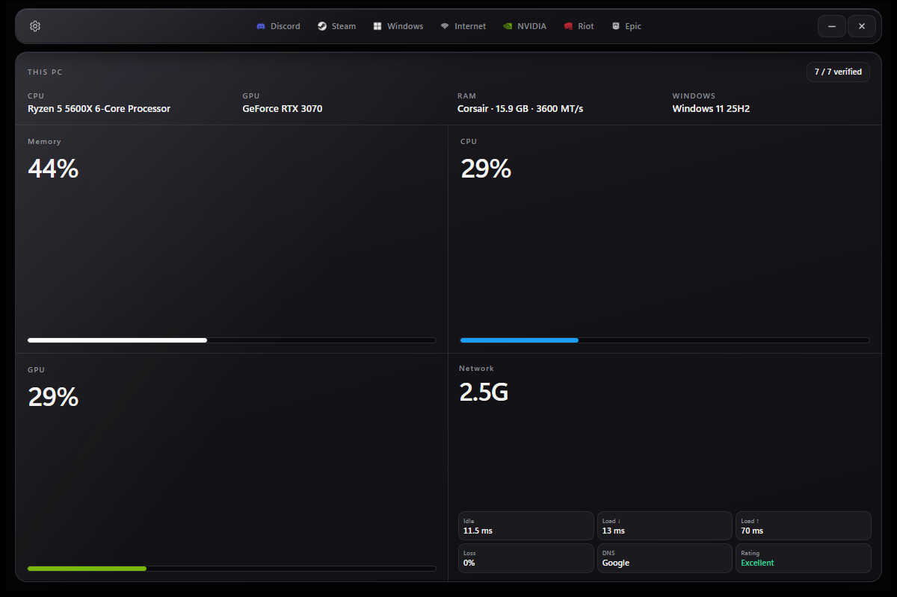

# Exo

**Your rig's brain. One orb. It reads your PC, asks, and optimizes.**

Exo used to be a tweaker with pages and toggles. It isn't anymore. The whole app is a single
monochrome thinking orb — a brain wired into your gaming PC. It scans what's actually installed,
tells you what it found in plain language, and asks one question at a time:

> *"NVIDIA is still running stock settings. Want me to optimize it?"*

You tap **Optimize**, **Skip**, or **Stop**. It works through your answers, tells you when your
rig is dialed in, and even asks before updating itself. Underneath the conversation is the same
verified engine Exo has always had: live detection, a controlled apply pipeline, and a Repair
path for everything it touches.

**Exo is free.** No ads, no account, no paywall. Building and shipping it still costs real money —
if it helps you, even **$1** keeps the project going:

[](https://www.buymeacoffee.com/UhhErix)

→ **[buymeacoffee.com/UhhErix](https://www.buymeacoffee.com/UhhErix)** — totally optional.

<p align="center">
  
</p>

---

## How a session goes

1. **It greets you.** "I'm Exo — the brain wired into your rig. Want me to see what we can sharpen?"
2. **It reads the PC.** A live scan of every system — what's installed, what's already optimized,
   what got reset since last time. The orb sweeps a scan line while it thinks.
3. **It asks.** One system at a time, biggest FPS levers first. It knows the difference between
   "never optimized" and "was optimized, something undid part of it," and it notices live
   conditions ("your RAM's sitting at 92%").
4. **It works.** Say yes and it applies through the verified pipeline, then moves to the next.
5. **It finishes honestly.** "Done. Everything you okayed is optimized." Nothing is ever applied
   without your yes — including updates to Exo itself.

The orb is alive the whole time: it roams the app on its own, wanders and glances while it
rests, throws in the odd playful spin or hop, scans while it reads, energizes while it works,
and glides back to center to talk.

---

## What the brain can optimize

| System | What a yes does |
|---|---|
| **NVIDIA** | Verified DRS / profile path with G-SYNC vs raw-latency handling; display policy without unsigned driver hacks |
| **Internet** | Lowest-latency or high-throughput profile from measured quality; TCP/QoS/NIC knobs only — no folklore DNS/MTU packs |
| **Steam** | Quiet CEF launcher, library high-perf GPU, download/config hygiene — no background helpers |
| **Games** | Per-title config quality + always borderless — user configs only, no packs, no game-binary mutation |
| **Discord** | Lean client path, voice QoS, Windows quiet (toasts/startup/tray) |
| **Brave** | Privacy/telemetry policy pack, high-perf GPU, quiet startup — full snapshot + restore Repair |

Machine-wide OS tuning (Game Mode, HAGS, power plan, Defender/WU policy) is a different problem
with different tools — we recommend a dedicated OS-tuning utility (**Nexus Playbook** or
**FSOS-X**) for that layer instead of half-maintaining it here.

---

## The contract

Most "FPS packs" dump folklore registry keys and hope. Exo's engine is built on a different deal:

| Principle | What it means |
|---|---|
| **Detect first** | Live registry, power plan, netsh, and app paths on *this* PC — never fixed assumptions ([docs/PC-AWARE.md](docs/PC-AWARE.md)) |
| **Ask before acting** | The brain proposes; you consent. Nothing applies on its own — updates included |
| **Apply with a real pipeline** | Native C# for host-integrated apps; SHA-256-verified kits for Discord & NVIDIA |
| **Never hang** | Hard timeouts on scheduled tasks and elevated work |
| **Repair always** | Pre-Exo snapshots so you can undo |
| **Anti-cheat safe** | No Vanguard, EOS, or game-binary mutation — user config files only |

---

## Install

**Requirements:** Windows 11 x64

1. Download **`Exo.exe`** from the [latest release](https://github.com/ImAvgErix/Exo/releases/latest)
2. Double-click to install (self-contained; the installer quietly ensures the .NET 10 Desktop
   Runtime, WebView2, PowerShell 7, and VC++ redist)
3. Launch from the Start Menu or `%LocalAppData%\Exo\app\Exo.exe`

PowerShell bootstrap (verifies published SHA-256):

```powershell
irm https://raw.githubusercontent.com/ImAvgErix/Exo/main/Install-Exo.ps1 | iex
```

**Updates:** the brain quietly checks for a newer build and, when one exists, offers it as an
option once it's done reading your PC — no launch pop-up. Nothing downloads without a yes.

Public builds are not code-signed; SmartScreen may appear. Prefer official GitHub releases only.

---

## The interface

- One monochrome dot-sphere orb on pure black — no pages, no menus, no module grid
- Plain-language questions with tap-to-answer chips; varied phrasing, live-vitals awareness
- Native Windows title bar (black, minimize/close only); fixed window
- Fonts bundled, fully offline; respects reduced-motion (the orb calms down, never freezes)
- WinUI 3 host + React/WebView2 — the entire UI is three source files

---

## Safety model

- Apply scripts are integrity-checked (length + SHA-256) across elevation
- Mutations are snapshotted for Repair where the module owns recovery
- Anti-cheat, game binaries, saves, and logins are **out of bounds** — Games only ever touches
  user config files, never packs, mods, or process/binary mutation
- Exo does **not** install services, tray stay-resident agents, analytics, or ads
- Exo reports observed policy and metrics; it does not promise universal FPS or ping

See [SECURITY.md](SECURITY.md) and [PRIVACY.md](PRIVACY.md).

---

## Build (developers)

```powershell
# UI (when changing the orb)
cd ui; npm ci; npm run build; cd ..

dotnet build Exo.sln -c Release -p:Platform=x64
pwsh -File tools/Test-Repository.ps1
pwsh -File Publish-Exo.ps1
```

Requirements: Windows 11, .NET 10 SDK, Windows App SDK / WinUI 3 tooling, PowerShell 7, Node.js
for UI rebuilds.

---

## Documentation

| Doc | Purpose |
|---|---|
| [CHANGELOG.md](CHANGELOG.md) | Release notes |
| [docs/TWEAK-AUDIT.md](docs/TWEAK-AUDIT.md) | Evidence-based tweak keep/drop list |
| [docs/INTERNET-GOLDEN-PATH.md](docs/INTERNET-GOLDEN-PATH.md) | Network stack contract |
| [CONTRIBUTING.md](CONTRIBUTING.md) | How to contribute |

---

## Support the project

Exo is free and always will be. Tips are optional and go a long way:

**[Buy me a coffee →](https://www.buymeacoffee.com/UhhErix)**

---

## License

[MIT](LICENSE) · One orb, verified underneath — not a generic "tweaker pack."
