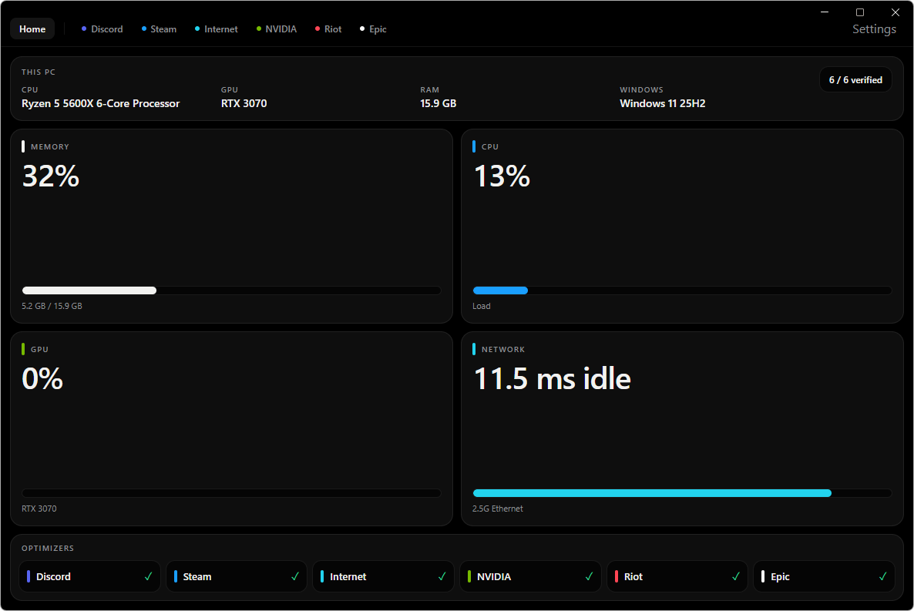

# Exo

Private, reversible Windows 11 optimization for Internet, NVIDIA, Discord,
Steam, Riot, and Epic.



Exo detects the current PC before it changes anything. Each module has one
primary **Apply**, a detector that explains the active policy, and a **Repair**
path that restores the captured pre-Exo state. The app is dark-only, local-first,
and leaves no Exo service, startup entry, scheduled task, tray process, account,
analytics, or advertising behind.

## Shell (3.7)

Exo’s UI is a fixed dark **liquid-glass** shell: native WinUI 3 window chrome
with a React/TypeScript WebView2 surface (Tailwind). Top bar keeps optimizers
centered, custom minimize/close live in the chrome, and Home shows live Memory /
CPU / GPU plus a network card (link rate, idle latency, load latency, loss, DNS,
rating). Module pages use Stable vs Experimental apply modes; features load fully
after detect (no half-list flash). Settings open as an overlay from the shell.

Native WinUI module pages remain in the tree for parity/fallback; the shipped
experience is the WebView shell.

## What it optimizes

| Module | Policy |
|---|---|
| Internet | Measures route, link, idle/load latency, loss, and DNS candidates; preserves multi-gig throughput; applies supported Windows/NIC host knobs only. |
| NVIDIA | Detects GPU series and topology; verified global/per-game DRS profiles; G-SYNC / VRR vs raw latency is an explicit choice (SafePolicy). |
| Discord | Lean client path (Equicord + Exo Host), voice QoS, **Windows** quiet (OS toasts / autostart / tray). **In-app** audio, reduced motion, and notification prefs are preserved on Stable Apply. |
| Steam | Supported client settings; background CEF helpers yield while gaming without kill/suspend/purge. |
| Riot | Reversible Windows startup / hybrid GPU / yield for detected Riot games — never Vanguard or game files. |
| Epic | Same launcher-scoped model for Epic-manifest games — never EOS, saves, or game files. |

**Stable** applies the full safe reversible stack. **Experimental** only force
re-imports, rebuilds, or tighter loops — it is not “more dangerous by default.”

Exo deliberately excludes folklore registry packs, forced MTU/jumbo frames,
anti-cheat changes, unsigned driver edits, destructive RAM purges, and global
settings whose correct value depends on the game. See
[the tweak audit](docs/TWEAK-AUDIT.md).

## Install

Download `Exo.exe` from the [latest release](https://github.com/ImAvgErix/Exo/releases/latest)
and double-click it. Self-contained Windows 11 x64.

In-app: **Settings → Check for updates** checks GitHub, then downloads and
quiet-installs with a progress bar in the settings panel (no separate update
card). Exo restarts when the installer is ready.

PowerShell bootstrap:

```powershell
irm https://raw.githubusercontent.com/ImAvgErix/Exo/main/Install-Exo.ps1 | iex
```

The bootstrap requires GitHub’s SHA-256 digest and checks the embedded version
before launch. Public builds are not code-signed, so Windows may show SmartScreen.
Do not download Exo from third-party mirrors.

Install path: `%LocalAppData%\Exo\app\`. The release `Exo.exe` is **self-contained**
(no separate .NET install). If Windows asks for .NET 10, you are not running the
GitHub release installer (reinstall from Releases, not a raw `bin` build).

## Safety model

- Apply/Repair scripts are length- and SHA-256-verified before and after UAC.
- Each mutation is capability-gated, snapshotted, verified, and repairable.
- Riot Vanguard, Epic Online Services, game binaries, saves, logins, and
  anti-cheat state are outside the mutation boundary.
- Discord Apply does **not** rewrite in-app audio, reduced motion, or Discord
  notification UI prefs; Windows toast quiet is separate and intentional.
- Exo reports observed metrics and policy state; it does not promise universal
  FPS, ping, RAM, or throughput gains.

Read [SECURITY.md](SECURITY.md) and [PRIVACY.md](PRIVACY.md) before using the
Discord client modification or system-wide network policy.

## Network home metrics

| Label | Meaning |
|---|---|
| Hero (e.g. 2.5G) | Negotiated **link capacity**, not ping |
| Idle | Unloaded ICMP RTT (p50) |
| Load ↓ / Load ↑ | ICMP RTT **while** saturating download / upload |
| Loss | Idle-path packet loss only |
| DNS | Selected resolver family from the last quality test |
| Rating | Simple grade from idle + load + loss (last quality sample) |

Full quality numbers appear after **Internet → Apply** (cached sample). Load ↑
can be much higher than idle under multi-gig upload queueing; that is reported,
not “fixed” by cutting throughput on multi-gig Ethernet.

## Build and test

Requirements: Windows 11, Windows App SDK / WinUI 3 tooling, PowerShell 7,
.NET 10 SDK, and Node.js (for the React UI when rebuilding `Exo/wwwroot`).

```powershell
# UI (optional if wwwroot is already current)
cd ui; npm ci; npm run build; cd ..

dotnet build Exo.sln -c Release -p:Platform=x64
pwsh -File tools/Test-Repository.ps1
pwsh -File Publish-Exo.ps1
```

CI runs UI, Network, Discord, Steam, NVIDIA, Riot/Epic, and contract smoke
suites. NVIDIA hardware behavior still needs a real NVIDIA Windows machine.

## Contributing

Issues and focused pull requests are welcome. Read [CONTRIBUTING.md](CONTRIBUTING.md).
Exo is available under the [MIT License](LICENSE).
