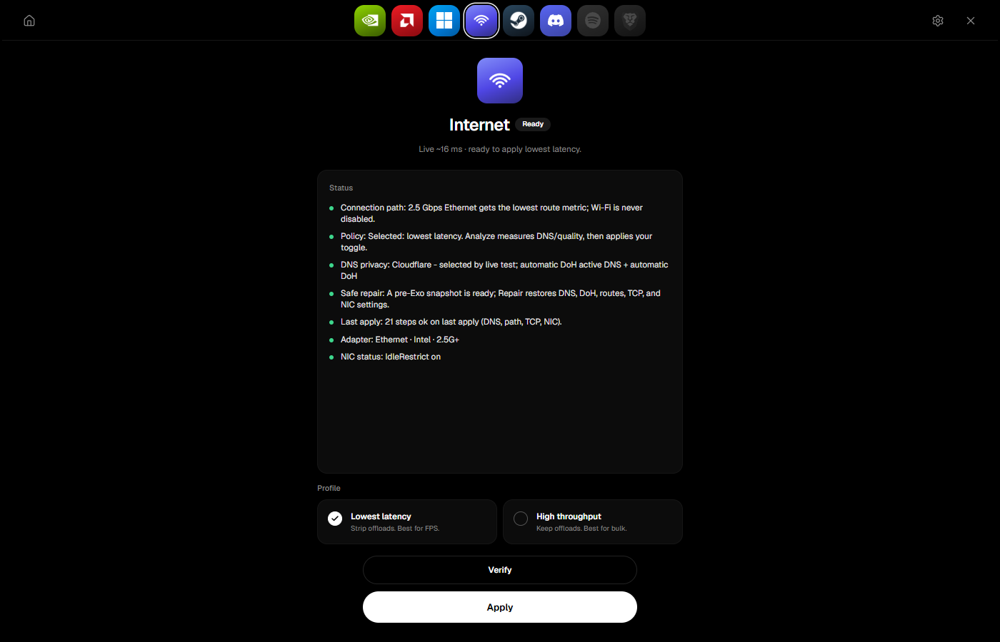
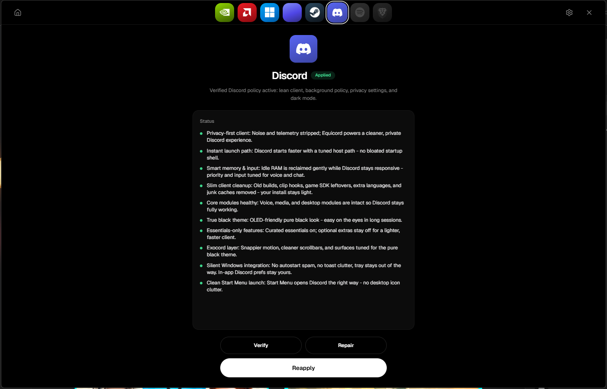

# Exo Hub

<p align="center">
  
</p>

**Presence without weight.**

Exo Hub is a **Windows gaming optimizer** that finds what is on your PC, applies only what helps, and checks that it stuck — without bloatware, accounts, or folklore tweak packs.

[](https://github.com/ImAvgErix/ExoHub/releases/latest)
[](LICENSE)
[](https://github.com/ImAvgErix/ExoHub/releases/latest)

<p align="center">
  <a href="https://github.com/ImAvgErix/ExoHub/releases/latest"><strong>Download ExoHub.exe</strong></a>
  &nbsp;·&nbsp;
  <a href="CHANGELOG.md">Changelog</a>
  &nbsp;·&nbsp;
  <a href="PRIVACY.md">Privacy</a>
  &nbsp;·&nbsp;
  <a href="https://www.buymeacoffee.com/UhhErix">Support</a>
</p>

<p align="center">
  
</p>

---

## What it does

| | |
| --- | --- |
| **Detect first** | Live inventory of CPU, GPU, memory, disk, NIC, Windows, and installed clients |
| **One-click apply** | Per-module Apply with progress; NVIDIA and Internet offer an explicit profile choice |
| **Verify & repair** | Re-detect any module, restore from snapshot when available |
| **Honest status** | Applied / Ready / Partial / Missing — green only when detection proves the write landed |
| **Safe by design** | Snapshot before write, SHA-256 script integrity, elevation per action, no tray agent |
| **AMOLED shell** | Fixed 1400×900 WinUI 3 + React UI |

---

## Optimizers

<p align="center">
  
</p>

| Module | Scope |
| --- | --- |
| **NVIDIA** | Native DRS / NVAPI profiles, G-SYNC / VRR or raw latency, per-title packs, max performance power |
| **AMD** | Ryzen chipset package health vs newest known; Radeon Software debloat when a Radeon GPU is present |
| **Windows** | Power plan, HAGS, Game Mode, Game Bar noise — gaming levers only |
| **Internet** | Latency or throughput profile after path measurement — offloads, stack prefs, adapter power |
| **Steam** | Overlay cost and launch weight while a game holds focus |
| **Discord** | Hardware acceleration, background load, and a lean client path without breaking voice |
| **Spotify** | Keep the client off the game GPU and out of the way |
| **Brave** | Policy and startup hygiene, fully restorable |

A module covers whatever of it is present. A Ryzen box with a GeForce card gets AMD for chipset and NVIDIA for the GPU — neither reads as missing.

<p align="center">
  
  &nbsp;
  
</p>

<p align="center">
  
  &nbsp;
  
</p>

---

## Install

**Requirements:** Windows 11 x64

### One-liner

```powershell
irm https://raw.githubusercontent.com/ImAvgErix/ExoHub/main/Install-Exo.ps1 | iex
```

### Manual

1. Download **ExoHub.exe** from [Releases](https://github.com/ImAvgErix/ExoHub/releases/latest)  
   (legacy alias **Exo.exe** is still accepted when present)
2. Run the installer → Start menu → open **Exo Hub**
3. Detect → select modules → Apply → Verify

Installs to `%LocalAppData%\Exo\app`. Builds are unsigned; SmartScreen may prompt once. Use GitHub releases only.

---

## How it works

```
Detect → Plan → Snapshot → Apply → Verify → (Repair)
```

1. **Detect** reads this machine — registry, NVAPI, chipset package, apps, network path  
2. **Snapshot** records prior state before any write  
3. **Apply** elevates only for the selected module  
4. **Verify** re-detects so **Applied** is never cosmetic  
5. **Repair** restores from snapshot when something drifts  

---

## Family

| Product | Role |
| --- | --- |
| **[Exo Hub](https://github.com/ImAvgErix/ExoHub)** | Gaming optimizers (this repo) |
| **[Exo OS](https://github.com/ImAvgErix/ExoOS)** | Windows gaming transform |
| **[Exo Link](https://github.com/ImAvgErix/ExoLink)** | Desktop chat & voice |
| **[Exo Launcher](https://github.com/ImAvgErix/ExoLauncher)** | Game library |

---

## Develop

```powershell
# UI → host wwwroot
cd ui; npm ci; npm run build; cd ..

# Run from source
.\Run-Exo.ps1

# Contracts + module smokes (no UAC)
dotnet run --project tools/Contracts.Smoke -c Release
dotnet run --project tools/Ui.Smoke -c Release
```

Root `VERSION` is the single product version (kept in lockstep with `ui/package.json`).

---

## Privacy

Local-first. No account. No ads. No telemetry by default — see [PRIVACY.md](PRIVACY.md).

## License

MIT © 2026 Erix ([ImAvgErix](https://github.com/ImAvgErix))

<p align="center"><sub>Presence without weight.</sub></p>
