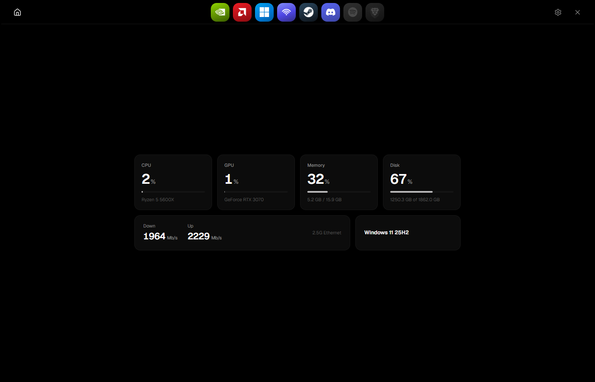
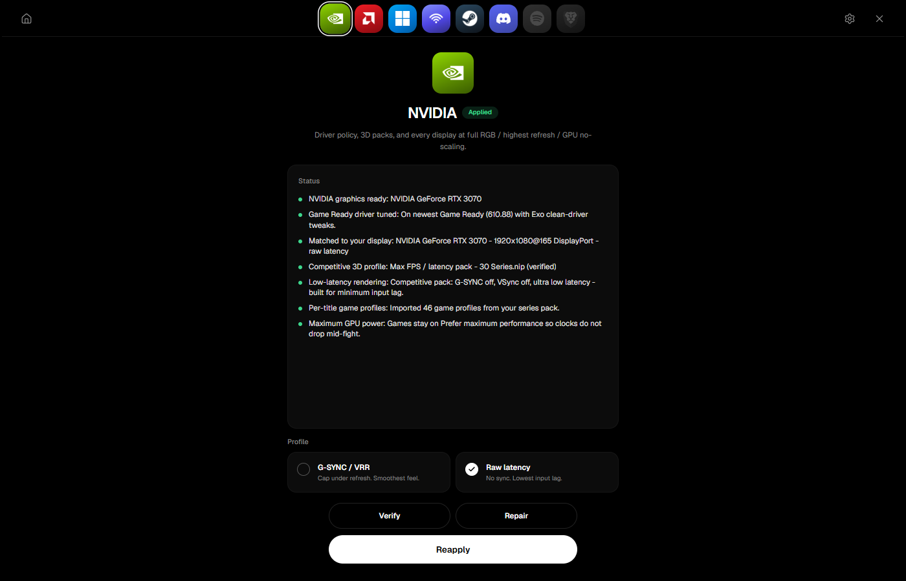
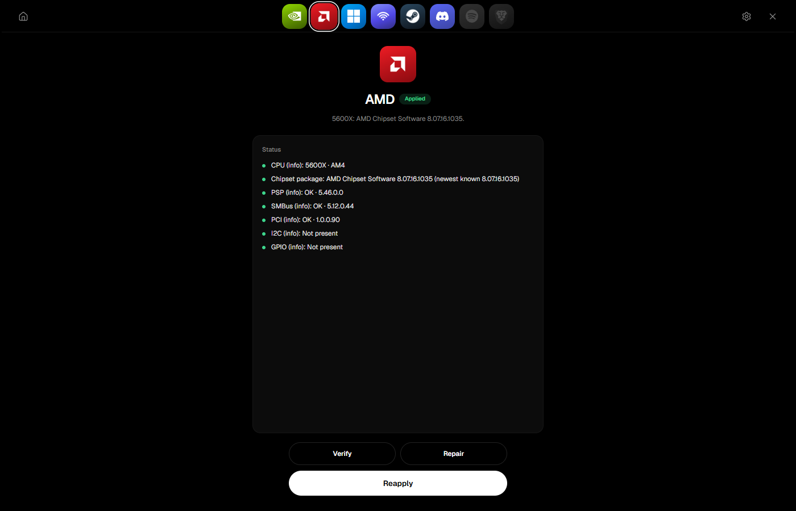
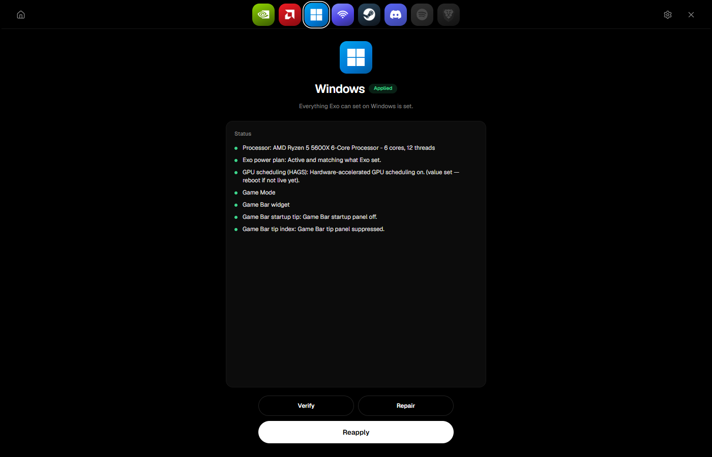

# Exo

**Built quiet. Tuned sharp.**

Native **Windows gaming optimizer**. Detect what’s on this PC. Apply verified modules. Snapshot first, verify after, repair when something drifts. No account. No ads. No folklore tweak packs.

[](https://github.com/ImAvgErix/Exo/releases/latest)
[](LICENSE)
[](https://github.com/ImAvgErix/Exo/releases/latest)
[](https://dotnet.microsoft.com/)

<p align="center">
  <a href="https://github.com/ImAvgErix/Exo/releases/latest"><strong>Download Exo</strong></a>
  &nbsp;·&nbsp;
  <a href="CHANGELOG.md">Changelog</a>
  &nbsp;·&nbsp;
  <a href="docs/USER-GUIDE.md">User guide</a>
  &nbsp;·&nbsp;
  <a href="https://www.buymeacoffee.com/UhhErix">Support</a>
</p>

<br />

<p align="center">
  
</p>

---

## What it is

Exo is the **per-module** layer of the stack: GPU, chipset, Windows gaming levers, network path, and everyday clients (Steam, Discord, …). It detects reality on *this* machine, applies only what fits, and re-checks so status never invents “Applied.”

| | |
| --- | --- |
| **Detect first** | Hardware + software inventory before any write |
| **Apply with progress** | One module at a time; NVIDIA / Internet pick an explicit profile |
| **Verify & repair** | Re-detect, restore snapshots when available, stop cleanly |
| **Honest status** | Applied / Ready / Partial / Missing — green only when detection proves it |
| **Safe by design** | Snapshot before write · SHA-256 script integrity · elevate per action · no tray agent |
| **AMOLED shell** | Fixed 1400×900 · true black · Geist · same language as Exo OS |

---

## Optimizers

<p align="center">
  
</p>

| Module | Scope |
| --- | --- |
| **NVIDIA** | DRS / NVAPI profiles, G-SYNC · VRR or raw latency, Game Ready path, per-title packs |
| **AMD** | Ryzen chipset package health; Radeon Software debloat when present |
| **Windows** | Power plan, HAGS, Game Mode, Game Bar noise — gaming levers only |
| **Internet** | Latency or throughput after path measurement |
| **Steam · Discord · Spotify · Brave** | Keep clients off the game path without breaking the app |

A module covers whatever is present. Ryzen + GeForce gets AMD for chipset and NVIDIA for the GPU.

<p align="center">
  
  &nbsp;
  
</p>

---

## Install

**Needs:** Windows 11 x64

```powershell
irm https://raw.githubusercontent.com/ImAvgErix/Exo/main/Install-Exo.ps1 | iex
```

Or download **Exo.exe** from [Releases](https://github.com/ImAvgErix/Exo/releases/latest). Builds are unsigned; SmartScreen may prompt. Use official GitHub releases only.

---

## How it works

```
Detect  →  Plan  →  Snapshot  →  Apply  →  Verify  →  (Repair)
```

---

## Family

| Product | Role |
| --- | --- |
| **[Exo](https://github.com/ImAvgErix/Exo)** | Gaming optimizers (this repo) |
| **[Exo OS](https://github.com/ImAvgErix/ExoOS)** | Full Windows transform — Balanced or Extreme |
| **[Exocord](https://github.com/ImAvgErix/Exocord)** | Native desktop chat & voice |
| **[Exo Launcher](https://github.com/ImAvgErix/ExoLauncher)** | One library UI; store clients as invisible backends |

---

## License

MIT © 2026 Erix ([ImAvgErix](https://github.com/ImAvgErix)) — see [LICENSE](LICENSE)

<p align="center"><sub>Built quiet. Tuned sharp.</sub></p>

